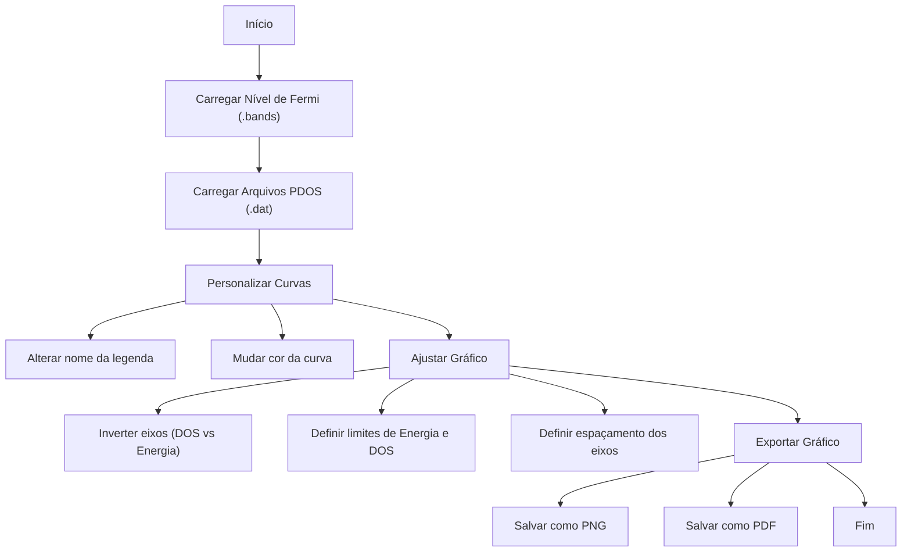

# Visualizador de Densidade de Estados (DOS-viewer)

## 💻 Sobre o Projeto

O **DOS-viewer** é um software de desktop desenvolvido em Python com **PyQt5** e **Matplotlib** para facilitar a visualização e análise de arquivos de Densidade de Estados (DOS) e Densidade de Estados Parciais (PDOS).

O software permite:
- **Carregamento de Múltiplos Arquivos:** Visualize várias curvas PDOS no mesmo gráfico.
- **Normalização de Energia:** Normalize as energias em relação a um Nível de Fermi de referência carregado de arquivos de bandas (`.bands`).
- **Personalização de Gráficos:** Altere rótulos, cores e os limites dos eixos do gráfico.
- **Exportação de Imagens:** Salve gráficos em formatos de alta qualidade como PNG e PDF.

Este projeto foi desenvolvido por Henrique Lago como parte de sua Iniciação Científica Voluntária no **Grupo de Nanofísica Computacional (GNC)** da Universidade Federal do Piauí (UFPI).

---

## 🚀 Como Executar

### Pré-requisitos
Certifique-se de ter o Python 3.x instalado.

### ⚙️ Instalação

Clone este repositório para a sua máquina local:

```bash
git clone https://github.com/seu-usuario/DOS-viewer.git

```
Navegue até o diretório do projeto:

```bash
cd DOS-viewer
```
Instale as dependências necessárias usando o pip:

```bash
pip install -r requirements.txt
```

### ▶️ Como Usar

Execute o script principal na pasta a partir do terminal:

```bash
python3 DOS_viewer.py
```
Uma tela de apresentação será exibida. Clique em "Seguir" para abrir a interface principal.
Utilize os botões "Carregar Nível de Fermi" e "Carregar Arquivos PDOS" para importar seus dados e começar a visualizar seus gráficos.

## 📊 Fluxo de Uso


### 🤝 Colaborações

Se você encontrar algum bug ou tiver sugestões para o projeto, sinta-se à vontade para abrir uma issue ou um pull request.

## 📜 Licença

Este projeto está licenciado sob a [MIT License](LICENSE).
Veja o arquivo `LICENSE` para mais detalhes.
---

## ⚛️ Conheça o Nosso Grupo GNC
<p align="center">

<p>
 Autor: Henrique Lago L.
este software foi desenvolvido para auxiliar e otimizar trabalhos na área da Teoria do Funcional da Densidade (DFT).
Foi criado durante minha iniciação científica voluntária na Universidade Federal do Piauí (UFPI), sob orientação do Professor Dr. Ramon Sampaio F., como membro do Grupo de Nanofísica Computacional (GNC/UFPI).

